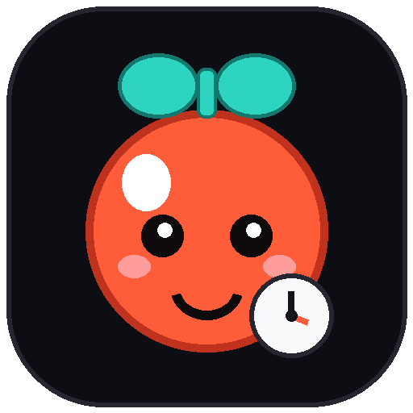

# 🌙 Midnight Pomodoro



A cute, OLED-dark Pomodoro timer for Windows. Stay focused with a glowing progress ring, gentle chimes, tasks, and stats — no account, no browser tab, no distractions.

## ⬇️ Install (easiest)

1. Go to [**Releases**](https://github.com/Siyam28102006/default-project/releases) and download **`MidnightPomodoro.exe`** from the newest version.
2. Double-click it. That's it — no Python needed.
3. Optional: right-click the running app → **Pin to taskbar** for one-click focus sessions.

> First run: Windows may show “Unknown publisher” → click **More info → Run anyway**. The exe is built from this repo with PyInstaller.

## 🐳 Run anywhere with Docker (Mac / Linux / server, no code)

1. Install [Docker Desktop](https://www.docker.com/products/docker-desktop/) (one-time).
2. Then either:
   ```bash
   # A) prebuilt image (nothing to download but Docker)
   docker run -d --name pomodoro -p 5800:5800 \
     -v pomodoro-data:/config \
     ghcr.io/siyam28102006/default-project:latest
   ```
   ```bash
   # B) build from this repo
   docker compose up -d --build
   ```
3. Open **http://localhost:5800** in your browser — the app is right there.
4. Stop with `docker stop pomodoro` (A) or `docker compose down` (B). Settings/tasks persist in the volume / `./data` folder.

## ▶️ Run from source

```bash
git clone https://github.com/Siyam28102006/default-project.git
cd default-project
pip install -r requirements.txt
python pomodoro.py
```

Requires Python 3.10+ on Windows / macOS / Linux.

## ✨ Features

- 🍅 Focus 25 / Short 5 / Long 15 — fully customizable with − / + steppers (or type any value), live-applied + one-tap presets (Classic / Quick / Deep)
- ⏯ Start / Pause / Resume, Reset, Skip — buttons or keyboard
- ⭕ Glowing progress ring with mode colors (ember / teal / violet)
- 🔥 Streak + stats row: cycle, completed sessions, tasks done
- 🔔 Gentle finish chime + window pop, auto-start breaks (toggleable)
- 📌 Always-on-top toggle for study sessions
- ✅ Task list: add with Enter, check off, delete, clear-done — auto-saved
- 💾 Settings + tasks persist in `pomodoro_data.json` (created next to the app)

### ⌨️ Shortcuts

| Key | Action |
|-----|--------|
| `Space` | Start / Pause |
| `R` | Reset timer |
| `S` | Skip to next mode |
| `1` / `2` / `3` | Focus / Short Break / Long Break |

## 🖼️ Icon

Cute tomato icon lives in this repo:

- `pomodoro.png` — preview + README art
- `pomodoro.ico` — Windows window + exe icon (16–256 px, generated with Pillow)

Regenerate it anytime:

```bash
pip install pillow
python make_icon.py
```

## 🛠️ Build your own exe

```bash
pip install -r requirements.txt pyinstaller
python -m PyInstaller --noconfirm --onefile --windowed \
  --name MidnightPomodoro --icon pomodoro.ico \
  --add-data "pomodoro.ico;." pomodoro.py
```

Find it at `dist/MidnightPomodoro.exe`.

## 📁 Files

| File | What |
|------|------|
| `pomodoro.py` | The whole app (single file) |
| `pomodoro.png` / `pomodoro.ico` | Cute desktop icon |
| `make_icon.py` | Icon generator (Pillow) |
| `requirements.txt` | `customtkinter`, `pillow` |
| `pomodoro_data.json` | Auto-created settings/tasks (git-ignored) |

## 💡 Tips

- Keep the cycle at 4: after 4 focuses you earn a long break.
- Pin the app on top while writing essays or coding.
- Add 1–3 tasks before you press Start — small lists win.

Made with Python + CustomTkinter. If it helps you focus, star the repo. 🌙
